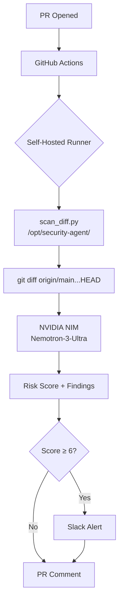
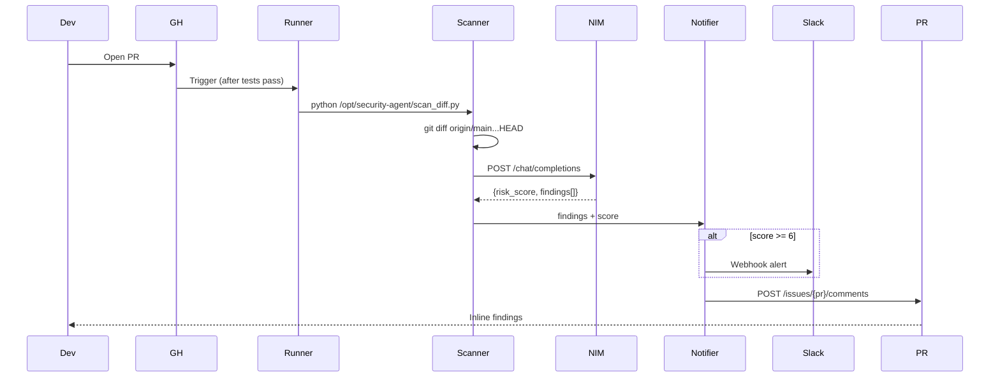

<div align="center">

# 🛡️ github-actions-ai-gatekeeper

**Enterprise-Grade AI Security Gatekeeper for CI/CD Pipelines**

</div>

Self-hosted LLM-powered security scanner that reviews every PR for vulnerabilities, secrets, and logic flaws — zero IP exposure, async feedback, Slack alerts on high-risk findings.

Built with Nemotron-3-Ultra via NVIDIA NIM on GitHub Actions self-hosted runners.

[](https://opensource.org/licenses/MIT)
[](https://nodejs.org/)
[](https://www.typescriptlang.org/)
[](https://www.python.org/)
[](https://github.com/features/actions)

---

## 📋 Table of Contents

- [Vision: Three Pillars](#-three-pillars)
- [Architecture](#️-architecture)
- [Quick Start](#-quick-start)
- [Configuration](#-configuration)
- [Project Structure](#-project-structure)
- [Testing](#-testing)
- [Scan Flow](#-scan-flow)
- [Example Outputs](#-example-outputs)
- [Roadmap](#-roadmap)
- [Contributing](#-contributing)
- [License](#-license)
- [Links](#-links)

---

## 🎯 Three Pillars

| Pillar | Summary |
|--------|---------|
| **🔒 IP Protection** | Self-hosted runner VM — code & secrets never leave your environment |
| **🧠 LLM Detection** | Nemotron-3-Ultra via NVIDIA NIM — OWASP Top 10, secrets, logic flaws, risk 0–10 |
| **⚡ Auto Feedback** | PR comments + Slack alerts (score ≥ 6) — async, non-blocking by default |

> **Current:** Uses NVIDIA's managed NIM endpoint. For air-gapped: deploy NIM on-prem, set `NVIDIA_NIM_URL`.

---

## 🏗️ Architecture



**Core Components:** Scanner (Python/OpenAI SDK) → LLM (NIM) → Notifier (GitHub API, Slack) → CI (GitHub Actions self-hosted) → Backend (Node/Express/TS)

---

## 🚀 Quick Start

### Prerequisites
- Self-hosted Linux VM (2+ vCPU, 8GB RAM)
- GitHub org with self-hosted runner permissions
- Slack Incoming Webhook URL
- NVIDIA API Key for NIM

### 1. Provision Runner VM
```bash
# On your private VM
sudo useradd -m -s /bin/bash github-runner
sudo usermod -aG docker github-runner
mkdir actions-runner && cd actions-runner
curl -o actions-runner-linux-x64-2.311.0.tar.gz -L \
  https://github.com/actions/runner/releases/download/v2.311.0/actions-runner-linux-x64-2.311.0.tar.gz
tar xzf actions-runner-linux-x64-2.311.0.tar.gz
./config.sh --url https://github.com/YOUR_ORG --token YOUR_RUNNER_TOKEN
sudo ./svc.sh install && sudo ./svc.sh start
```

### 2. Install Scanner on Runner VM
```bash
sudo mkdir -p /opt/security-agent
sudo cp templates/scan_diff.py templates/scanner_utils.py templates/security_notifier.py /opt/security-agent/
sudo chown -R github-runner:github-runner /opt/security-agent

# Create .env with secrets (never commit!)
sudo tee /opt/security-agent/.env > /dev/null <<'EOF'
NVIDIA_API_KEY=nvapi-your-key
SLACK_WEBHOOK_URL=https://hooks.slack.com/services/...
GH_TOKEN=ghp_your-pat
EOF
sudo chmod 600 /opt/security-agent/.env
```

### 3. Use Included Workflow
Workflow at `.github/workflows/ci.yaml`:
- `build_and_test` — Node.js install + tests
- `ai_security_gate` — Runs scanner after tests pass (PRs only)

### 4. Add GitHub Secrets
| Secret | Value |
|--------|-------|
| `NVIDIA_API_KEY` | Your NIM API key |
| `SLACK_WEBHOOK_URL` | Slack webhook URL |
| `GH_TOKEN` | GitHub PAT (`repo` scope) |

---

## ⚙️ Configuration

### Environment Variables (`/opt/security-agent/.env`)
| Variable | Required | Description | Docs |
|----------|----------|-------------|------|
| `NVIDIA_API_KEY` | ✅ | NIM API key for Nemotron-3-Ultra | [Get Key](https://build.nvidia.com/nvidia/nemotron-3-ultra) |
| `SLACK_WEBHOOK_URL` | ✅ | Slack Incoming Webhook | [Create](https://api.slack.com/messaging/webhooks) |
| `GH_TOKEN` | ✅ | GitHub PAT with `repo` scope | [Create](https://github.com/settings/tokens) |
| `GITHUB_REPOSITORY` | Auto | Injected by Actions | — |
| `PR_NUMBER` | Auto | Injected by Actions | — |

### Risk Thresholds
| Score | Severity | PR Comment | Slack Alert |
|-------|----------|------------|-------------|
| 0–3 | Low | ✅ | ❌ |
| 4–5 | Medium | ✅ | ❌ |
| **6–7** | **High** | ✅ | ✅ |
| 8–10 | Critical | ✅ | ✅ |

> Slack triggers at **score ≥ 6** (`scan_diff.py:95`)

---

## 📂 Project Structure

```
github-actions-ai-gatekeeper/
├── .github/workflows/ci.yaml     # CI: Node tests + AI gate
├── src/                          # Node.js/Express backend
│   ├── db.ts                     # Mock document DB
│   └── server.ts                 # API server
├── templates/                    # Source (copy to /opt/security-agent/)
│   ├── .env.example
│   ├── scan_diff.py              # Main scanner
│   ├── scanner_utils.py          # Git diff extraction
│   ├── security_notifier.py      # PR comments + Slack
│   └── requirements.txt
├── tests/server.test.ts          # Jest + Supertest
├── package.json
└── README.md
```

---

## 🧪 Testing

```bash
# Node.js backend
npm test

# Python scanner (local dev)
cd templates
pip install -r requirements.txt
cp .env.example .env  # fill in values
python scan_diff.py   # needs git history (origin/main...HEAD)
```

---

## 🔄 Scan Flow



---

## 📝 Example Outputs

**PR Comment:**
```markdown
### 🛡️ AI Security Gatekeeper Audit
**Risk Score:** `8/10`
#### Findings:
- SQL Injection: string concatenation in auth query
- Hardcoded AWS key in config file
- Auth bypass in fallback login path
```

**Slack Alert:**
```
🚨 Critical Security Warning: PR #42 in `myorg/repo`
Risk: 8/10
• SQL Injection in auth module
• Hardcoded AWS key detected
• Auth bypass in fallback path
```

---

## Feature Implement

| Area | Current | Planned |
|------|---------|---------|
| **Model** | Nemotron-3-Ultra (cloud) | DeepSeek-V4 on self-hosted NIM |
| **NIM Endpoint** | `integrate.api.nvidia.com` | On-prem `localhost:8000` |
| **Scripts** | Hardcoded `/opt/security-agent/` | Repo-relative `templates/` |
| **Env Loading** | Hardcoded path | Workspace `.env` |
| **Threshold** | ≥6 hardcoded | Configurable `RISK_THRESHOLD` (default 7) |
| **Orchestration** | GitHub Actions only | n8n for retries/observability |
| **PR Format** | Bullets | Rich table (file/line/severity) |

---

## 🤝 Contributing

1. Fork → branch → commit → push → PR
2. **This gatekeeper scans every PR** — high-risk findings alert maintainers via Slack

---

## 📄 License

MIT — see [LICENSE](LICENSE)

---

## 🔗 Links

- **Repo:** [github.com/munnavuyyuru/github-actions-ai-gatekeeper](https://github.com/munnavuyyuru/github-actions-ai-gatekeeper)
- **Nemotron-3-Ultra:** [build.nvidia.com/nvidia/nemotron-3-ultra](https://build.nvidia.com/nvidia/nemotron-3-ultra) — [API](https://docs.nvidia.com/nim/large-language-models/latest/api-reference.html)
- **NVIDIA NIM:** [docs.nvidia.com/nim](https://docs.nvidia.com/nim)
- **GitHub Runners:** [docs.github.com/actions/hosting-your-own-runners](https://docs.github.com/en/actions/hosting-your-own-runners)
- **Slack Webhooks:** [api.slack.com/messaging/webhooks](https://api.slack.com/messaging/webhooks)
- **OWASP Top 10:** [owasp.org/www-project-top-ten](https://owasp.org/www-project-top-ten/)

---
